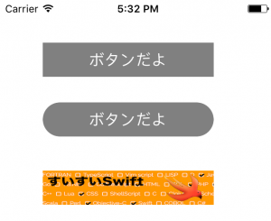

+++
title = "UIButton"
url = "2017-05-05"
date = "2017-05-05"
description = "UIButton"
tags = [
    "iOS",
]
categories = [
    "iOS",
]
archives = "2017/05"
aliases = ["migrate-from-jekyl"]
+++

 

UIButtonクラスはボタンを設置するためのクラスです。  
ボタンタップでアクションを起こすことができます。  

UIButtonのクラス階層  

NSObject  
↑  
UIResponder  
↑  
UIView  
↑  
UIControl  
↑  
UIButton  
[AppleDeveloperリファレンスUIButton](https://developer.apple.com/documentation/uikit/uibutton)

UIButton例文

様々なUIButtonのサンプルです

<!-- Google Ads -->


<!-- Amazon Ads -->



