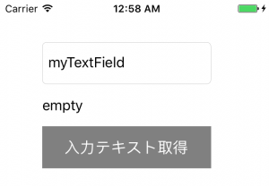

+++
title = "UITextField"
url = "2017-05-12"
date = "2017-05-12"
description = "UITextField"
tags = [
    "iOS",
]
categories = [
    "iOS",
]
archives = "2017/05"
aliases = ["migrate-from-jekyl"]
+++

 

UITextFieldは文字の入力に使われます。

UITextFieldのクラス階層

NSObject  
↑  
UIResponder  
↑  
UIView  
↑  
UIControl  
↑  
UITextField  
AppleDeveloperリファレンスUITextField  

UITextField例文

UITextField、生成し、ボタンが押されるとUITextFieldから文字列を取り出してラベルにコピーします。

<!-- Google Ads -->


<!-- Amazon Ads -->



