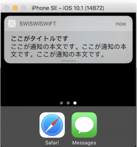

+++
title = "UserNotification(LocalNotification)"
url = "2017-05-14"
date = "2017-05-14"
description = "UserNotification(LocalNotification)"
tags = [
    "iOS",
]
categories = [
    "iOS",
]
archives = "2017/05"
aliases = ["migrate-from-jekyl"]
+++

 

UserNotificationはユーザーに対して通知を発行する時に使用します。  
UserNotificationは大きく分けて二種類あり、外部から通知を発行できるRemoteNotification(LineやTwitterのような通知)とLocalNotification(時計アプリなどの内部的に発行する通知)があります。  
ここではLocalNotificationを取り扱います。  

UserNotificationサンプル  

初めにオリジナル通知音の発行に使用する音データ(.cafファイル)をプロジェクトに登録します。  
`.caf` ファイルをプロジェクトに追加し、BundleResoucesに登録されていることを確認します。  
また使用したcafファイルはこちらです。  
UserNotificationの仕様として、使用するオリジナル通知音に不具合がある場合、デフォルトの通知音が再生されます。  

<!-- Google Ads -->


<!-- Amazon Ads -->



