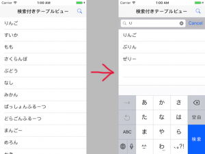

+++
title = "UITableViewとUISearchBar"
url = "2017-05-15"
date = "2017-05-15"
description = "UITableViewとUISearchBar"
tags = [
    "iOS",
]
categories = [
    "iOS",
]
archives = "2017/05"
aliases = ["migrate-from-jekyl"]
+++

 

UITableViewとUISearchBarを組み合わせたサンプルです。  
ナビゲーションバーにある虫眼鏡を押すとSearchBarが現れ、そこに文字を入力することで検索結果が表示されます。  

UITableView  

基本的なテーブルビューの例文を以下に示します。  

<!-- Google Ads -->


<!-- Amazon Ads -->



