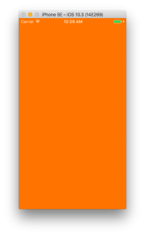

+++
title = "UIStatusBarを白くする"
url = "2017-05-16"
date = "2017-05-16"
description = "UIStatusBarを白くする"
tags = [
    "iOS",
]
categories = [
    "iOS",
]
archives = "2017/05"
aliases = ["migrate-from-jekyl"]
+++

 
UIStatusBarを白くする方法についてです。  

UIStatusBarを白くする方法その1  

UIStatusBarを白くする方法その1です。特定のViewControllerを白くする方法です。白くしたいUIViewControllerに書きます。  
NavigationController以下にあるStatusBarはこの方法では白くはなりませんので注意してください。  

UIStatusBarを白くする方法その2

全てのStatusBarを白くする方法です。  
プロジェクトのターゲットのinfoに[Status bar style]と[UIStatusBarStyleLightContent]、[View controller-based status bar appearance]と[NO]を追加します。NavigationController以下にあるStatusBarも白くなります。  
 わかりやすいようにViewの背景色をオレンジにしています。  

 
 

 <!-- Google Ads -->
 

 <!-- Amazon Ads -->
 


