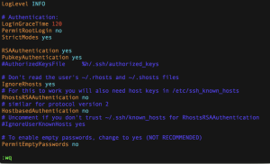

+++
title = "rootのログインを禁止にする"
url = "2017-06-08"
date = "2017-06-08"
description = "rootのログインを禁止にする"
tags = [
    "Linux",
]
categories = [
    "Linux",
]
archives = "2017/06"
aliases = ["migrate-from-jekyl"]
+++

<br>


VPSを借りて一番最初に行うrootのログインの禁止のメモです。  

rootでサーバーにログインしてパスワードを入力します。  

```
$ ssh -l root xxx.xxx.xxx.xxx
```

ユーザーの追加をします。onojunというユーザーを追加します。  

```
$ adduser onojun
```

パスワードを設定します。OSによってはadduserの時に設定するはずです。  

```
$ passwd onojun
```

一旦ログアウします。

```
$ exit
```

作成したonojunでログインできるか確かめます。SSHのログインコマンドはお好みで  


```
$ ssh onojun@xxx.xxx.xxx.xxx
```

ログインできたらrootに切り替えます。  

```
$ su -
```

sshの設定ファイルを編集します。バックアップも作って上げます。  

```
$ cd /etc/ssh
$ cp sshd_config sshd_config.old
```

vimで設定ファイルを編集します。PermitRootLogin noにしてあげます。  

```
$ vim sshd_config
```

40行目ぐらいにあります。  

```
PermitRootLogin no
```



ssshの再起動  

```
$ service sshd restart
```

rootでログインできなかったら終わり！！

<!-- Google Ads -->


<!-- Amazon Ads -->

