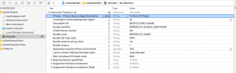
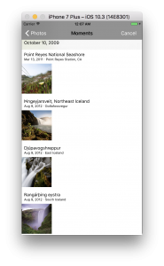
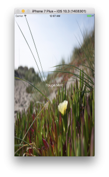

+++
title = "UIImagePickerControllerで画像の選択"
url = "2017-06-14"
date = "2017-06-14"
description = "UIImagePickerControllerで画像の選択"
tags = [
    "iOS",
]
categories = [
    "iOS",
]
archives = "2017/06"
aliases = ["migrate-from-jekyl"]
+++

 

iPhoneのフォトライブラリから画像を取得するサンプルプログラムです。  

フォトライブラリから画像を選択するために、プロジェクトの `info.plist` にフォトライブラリを使用する旨を記述します。  
これを書いておかないとUIImagePickerControllerは使えません。  
キーの値は以下の値を使います。  
`NSPhotoLibraryUsageDescription`  
Typeは `String` でValueの中に使用理由を書きます。  
使用理由を書かないと審査の時に落とされるらしいです。  
下の画像のような感じです。  

コードは以下のようになります。

<!-- Google Ads -->


<!-- Amazon Ads -->



