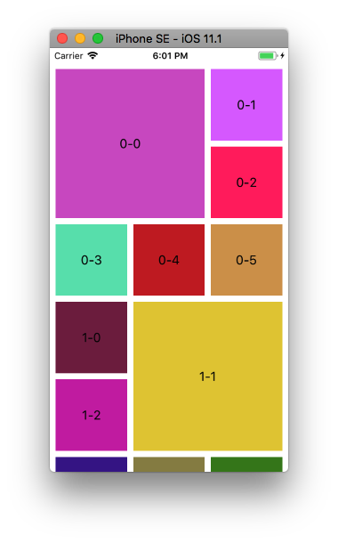

+++
title = "カスタムレイアウトを持つコレクションビューをつくる"
url = "2017-11-27"
date = "2017-11-27"
description = "カスタムレイアウトを持つコレクションビューをつくる"
tags = [
    "iOS",
]
categories = [
    "iOS",
]
archives = "2017/11"
aliases = ["migrate-from-jekyl"]
+++

 

今作成しているアプリに画像が入れ子となったデザインをつくることになったので、実装方法について調べました。  

主なコードは以下のサイトを参考にさせていただきました。  
本当にありがとうございました。  
Swift2->4の変換は大変でした。。。  

[iOS UICollecionViewFlowLayout でカスタムレイアウトを作ろう ～ Swift版](https://www.indetail.co.jp/blog/5257/)

<!-- Google Ads -->


<!-- Amazon Ads -->



