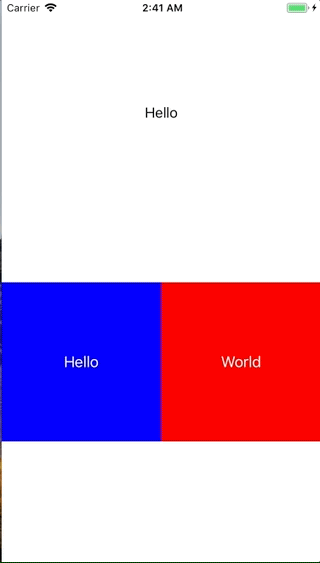

+++
title = "UserDefaultsを使ってパラメーターを保存する"
url = "2018-01-17"
date = "2018-01-17"
description = "UserDefaultsを使ってパラメーターを保存する"
tags = [
    "iOS",
]
categories = [
    "iOS",
]
archives = "2018/01"
aliases = ["migrate-from-jekyl"]
+++

 

UserDefaultsはアプリを落としても保持しておきたいデータを保存するときに使います。  
使い方はいたってシンプルです。  
サンプルコードでは、まず最初に `userDefaults.register(defaults: ["KEY_LabelText": "Hello"])` で初期値を設定しています。  
`.register（）` はとても便利で、指定したキーに対応するデータが存在しない場合に、初期値を入れてくれます。  
次にラベルにUserDefaultで保存した値を読み取り、ラベルのテキストに反映。  
そしてボタンを押されたらuserdefaultsとラベルの値を更新しています。  

<!-- Google Ads -->


<!-- Amazon Ads -->



