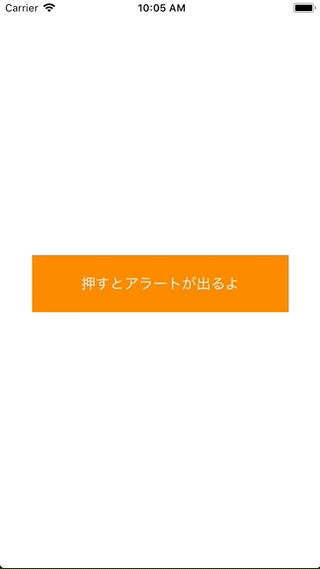

+++
title = "UIAlertControllerで下からニュッと出す(UIActionSheet)"
url = "2018-03-05"
date = "2018-03-05"
description = "UIAlertControllerで下からニュッと出す(UIActionSheet)"
tags = [
    "iOS",
]
categories = [
    "iOS",
]
archives = "2018/03"
aliases = ["migrate-from-jekyl"]
+++

 

下からニュッと出てくるアラートはUIAlertControllerを用いて実装します。  
遥か昔、下からニュッと出てくるアラートはUIActionSheetなんて呼ばれている時期もありましたが、UIAlertControllerに統合されました。  

<!-- Google Ads -->


<!-- Amazon Ads -->



