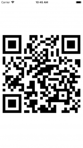

+++
title = "文字列やURLからQRコードを生成する"
url = "2018-03-07"
date = "2018-03-07"
description = "文字列やURLからQRコードを生成する"
tags = [
    "iOS",
]
categories = [
    "iOS",
]
archives = "2018/03"
aliases = ["migrate-from-jekyl"]
+++

 

文字列やURLからQRコードを生成するサンプルコードです。  
This is a sample code that generates a QR code from a character string or URL.  

これらの記事を参考にさせていただきました。  

[CIImageをData型に変換したときにハマった時の対処法(Swift3.0)](https://qiita.com/coffeemk2/items/5f6f5352f9b8b1b02ec9)  
[SwiftでQRコードを生成してみた](https://qiita.com/matsuhisa_h/items/91cdeeaf32553c3b23fb)

生成したQRコードはこちらです。  

<!-- Google Ads -->


<!-- Amazon Ads -->



