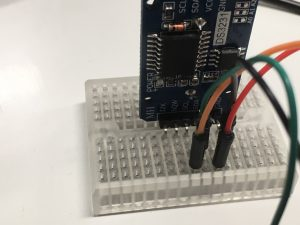

+++
title = "ESP32でRTCモジュールを使う"
url = "2018-03-14"
date = "2018-03-14"
description = "ESP32でRTCモジュールを使う"
tags = [
    "ESP32",
]
categories = [
    "ESP32",
]
archives = "2018/03"
aliases = ["migrate-from-jekyl"]
+++

 

ESP32でRTCモジュールを使おうとしたら少し詰まったので記事にしました。
結論を先に書くと、#include　DS1307RTC.h　を一番上に持ってくることで解決しました。
サンプルコードのReadTestのESP32バージョンになります。

使用ライブラリと機材は以下の通りです。

DS1307RTCライブラリ
[github.com/PaulStoffregen/DS1307RTC](https://github.com/PaulStoffregen/DS1307RTC)

[ESPr® Developer 32 ](https://amzn.to/2u4PvEn)

[HiLetgo 3個セット DS3231 AT24C32 時計モジュール リアル時間時計モジュール IICモジュール RTCモジュール Arduinoに対応 並行輸入品](https://amzn.to/39qbi9R)

配線図  

<!-- Google Ads -->


<!-- Amazon Ads -->



