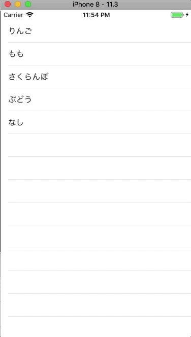

+++
title = "TableViewを編集してCellを削除する(横スライド)"
url = "2018-04-23"
date = "2018-04-23"
description = "TableViewを編集してCellを削除する(横スライド)"
tags = [
    "iOS",
]
categories = [
    "iOS",
]
archives = "2018/04"
aliases = ["migrate-from-jekyl"]
+++

<br>

TableViewを編集してCellを削除するサンプルコードです。  
以下の関数を追加することで、セルを横スライドで削除できる機能を付けることができます。  


```
func tableView(_ tableView: UITableView, commit editingStyle: UITableViewCellEditingStyle, forRowAt indexPath: IndexPath)
```



<!-- Google Ads -->


<!-- Amazon Ads -->



