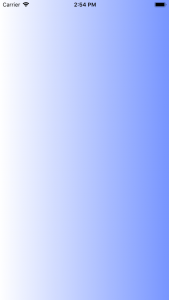

+++
title = "UIViewの背景をグラデーションさせる"
url = "2018-05-06"
date = "2018-05-06"
description = "UIViewの背景をグラデーションさせる"
tags = [
    "iOS",
]
categories = [
    "iOS",
]
archives = "2018/05"
aliases = ["migrate-from-jekyl"]
+++

 

UIViewの背景をグラデーションさせるサンプルコードです。  

参考にさせていただいたページ  
[【Swift x iOSアプリ開発】Viewの背景色にグラデーションを設定する方法](http://amazarashi.me/ios-swift-background-gradiation/)
[Swift UIViewの背景をグラデーションさせる方法　-iPhoneアプリ開発- ](https://techno-monkey.com/swift-uiview-gradation-iphoneapp/)

<!-- Google Ads -->


<!-- Amazon Ads -->


 
