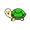
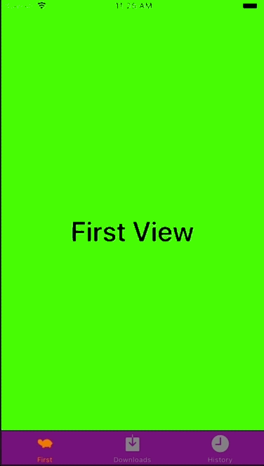

+++
title = "UITabBarControllerを実装する"
url = "2018-06-02"
date = "2018-06-02"
description = "UITabBarControllerを実装する"
tags = [
    "iOS",
]
categories = [
    "iOS",
]
archives = "2018/06"
aliases = ["migrate-from-jekyl"]
+++

 

Viewの切り替えに使われるUITabBarControllerを実装サンプルです。  
UITabBarControllerのアイコンは30×30の透過pngです。  

 

<!-- Google Ads -->


<!-- Amazon Ads -->



