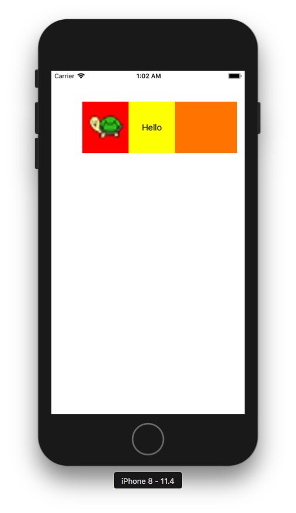

+++
title = "CustomViewをコードで実装する"
url = "2018-06-19"
date = "2018-06-19"
description = "CustomViewをコードで実装する"
tags = [
  "iOS",
]
categories = [
  "iOS",
]
archives = "2018/06"
aliases = ["migrate-from-jekyl"]
+++

 

コードでカスタムビューを作り表示するサンプルです。  
私はxibやstoryboradを使わずに実装するのが好きですが、何がベストなのでしょうか。  

<!-- Google Ads -->


<!-- Amazon Ads -->



