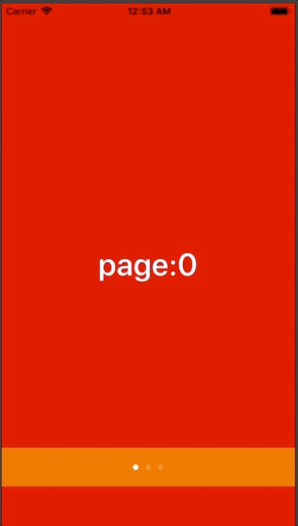

+++
title = "PageViewControllerとPageControl"
url = "2018-06-21"
date = "2018-06-21"
description = "PageViewControllerとPageControl"
tags = [
    "iOS",
]
categories = [
    "iOS",
]
archives = "2018/06"
aliases = ["migrate-from-jekyl"]
+++

 

チュートリアル画面や電子書籍リーダーによく使われるPageViewControllerの実装サンプルです。

<!-- Google Ads -->


<!-- Amazon Ads -->



