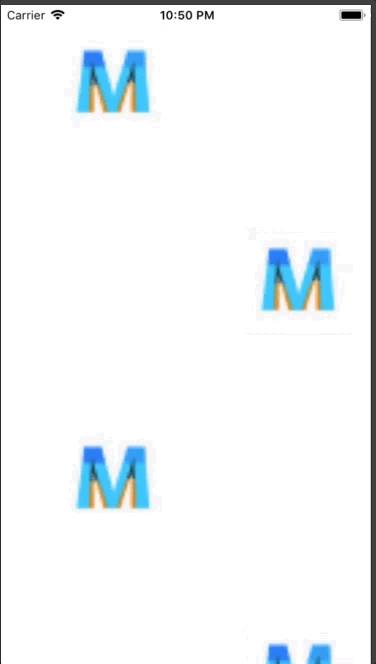

+++
title = "流れるように動く背景を実装する"
url = "2018-06-28"
date = "2018-06-28"
description = "流れるように動く背景を実装する"
tags = [
    "iOS",
]
categories = [
    "iOS",
]
archives = "2018/06"
aliases = ["migrate-from-jekyl"]
+++

 

私が作っている４択化学というアプリの背景の実装方法をたまに聞かれるので、それのサンプルコードを書きました。  
アプリのアイコン画像がViewの背景を流れます。  
またviewDidLoadにアニメーション関係のメソッドを書くと、NavigationBarの遷移によりアニメーションが止まってしまうことがあります。  
その場合はアニメーション関係のメソッドをviewWillAppearに書き出すことで解決します。  

<!-- Google Ads -->


<!-- Amazon Ads -->



