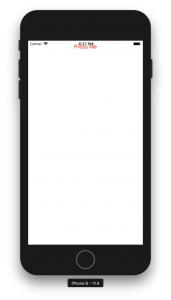

+++
title = "ReactNativeでボタンを表示する"
url = "2018-08-12"
date = "2018-08-12"
description = "ReactNativeでボタンを表示する"
tags = [
    "ReactNative",
]
categories = [
    "ReactNative",
]
archives = "2018/08"
aliases = ["migrate-from-jekyl"]
+++

 

ReactNativeでボタンを表示するサンプルです。  
ボタンを押すとアラームが表示されます。  

react-native: 0.56.0  

<!-- Google Ads -->


<!-- Amazon Ads -->



