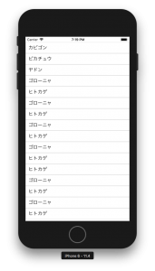

+++
title = "ReactNativeでFlatListを表示する"
url = "2018-08-13"
date = "2018-08-13"
description = "ReactNativeでFlatListを表示する"
tags = [
    "ReactNative",
]
categories = [
    "ReactNative",
]
archives = "2018/08"
aliases = ["migrate-from-jekyl"]
+++

 

ReactNativeでFlatListを表示するサンプルです。  
react-native: 0.56.0  で動作を確認しました。

<!-- Google Ads -->


<!-- Amazon Ads -->



