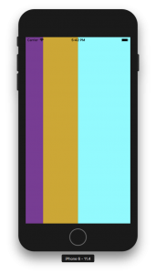

+++
title = "FlexBoxでViewの大きさを指定する"
url = "2018-08-14"
date = "2018-08-14"
description = "FlexBoxでViewの大きさを指定する"
tags = [
    "ReactNative",
]
categories = [
  "ReactNative",
]
archives = "2018/08"
aliases = ["migrate-from-jekyl"]
+++

 

FlexBoxでViewの大きさを指定するサンプルコードです。

react-native: 0.56.0

紫、黄土色、水色のViewが　1 : 2 : 3 の高さになっています。



横にするには
flexDirection: 'row'と設定します。

<!-- Google Ads -->


<!-- Amazon Ads -->



