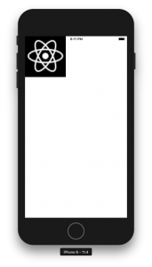
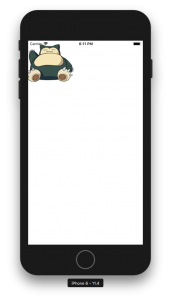

+++
title = "ReactNativeで画像を表示する"
url = "2018-08-15"
date = "2018-08-15"
description = "ReactNativeで画像を表示する"
tags = [
    "ReactNative",
]
categories = [
    "ReactNative",
]
archives = "2018/08"
aliases = ["migrate-from-jekyl"]
+++

 

ReactNativeで画像を表示するサンプルです。  
iOSで画像をインターネットから取得する場合はATSを設定する必要があるので気をつけてください。  

react-native: 0.56.0

<!-- Google Ads -->


<!-- Amazon Ads -->



