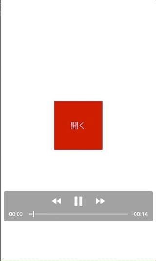

+++
title = "iOSでバーコードを読み取る"
url = "2018-09-17"
date = "2018-09-17"
description = "iOSでバーコードを読み取る"
tags = [
    "iOS",
]
categories = [
    "iOS",
]
archives = "2018/08"
aliases = ["migrate-from-jekyl"]
+++

 

Swiftでバーコードを読み取るサンプルコードです。
Swift 4.1

// 参考にさせて頂いたサイトです  

[Swift 4でQRコードを読み取る](https://shinjism.com/blog/2017/10/qrcode.html)  
[AVFoundation(AVCaptureMetadataOutput)でバーコードリーダーを作ってみた](https://dev.classmethod.jp/smartphone/ios-avfoundation-avcapturemetadataoutput-ean13-ean8/)  

まず、`info.plist`に
`Privacy - Camera Usage Description` のキーを追加し、使用理由を記述します。
「バーコードリーダー読み込みます」などなど。
この文言は使用許可を求める時に表示されます。

<!-- Google Ads -->


<!-- Amazon Ads -->



