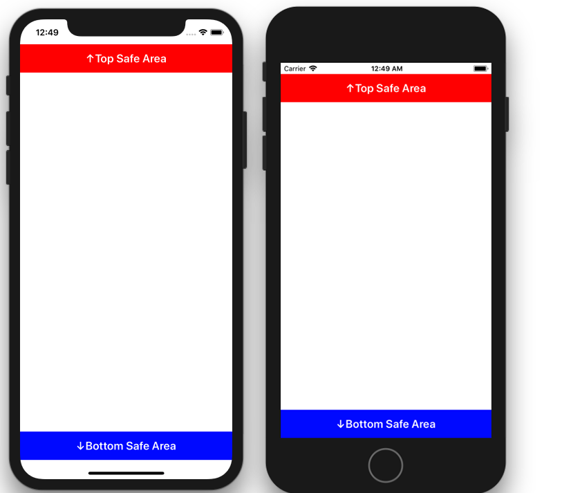

+++
title = "SafeAreaを取得する"
url = "2018-09-19"
date = "2018-09-19"
description = "SafeAreaを取得する"
tags = [
    "iOS",
]
categories = [
    "iOS",
]
archives = "2018/09"
aliases = ["migrate-from-jekyl"]
+++

 

iPhoneXが登場したことで、iPhoneXのレイアウト(SafeAreaの取得)には気を使うようになりました。  
SafeAreaはviewDidLayoutSubviews メソッド内で、safeAreaInsets プロパティを参照することで取得することができます。  

<!-- Google Ads -->


<!-- Amazon Ads -->



