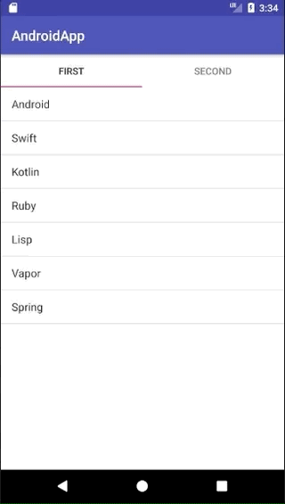

+++
title = "KotlinでListViewを内包したTabを作成する"
url = "2018-09-25"
date = "2018-09-25"
description = "KotlinでListViewを内包したTabを作成する"
tags = [
    "Android",
]

categories = [
    "Android",
]
archives = "2018/09"
aliases = ["migrate-from-jekyl"]
+++

 

KotlinでListViewを内包したTabを作成しました。

参考にさせて頂いたWebページです。
すごく良い記事なので、この記事より彼の記事をみてください。
[Getting Started with Tabs in Android — Kotlin](https://medium.com/@eijaz/getting-started-with-tablayout-in-android-kotlin-bb7e21783761)

build.gradle に以下のdependencyを追加します。

`implementation 'com.android.support:design:26.1.0'`

<!-- Google Ads -->


<!-- Amazon Ads -->



