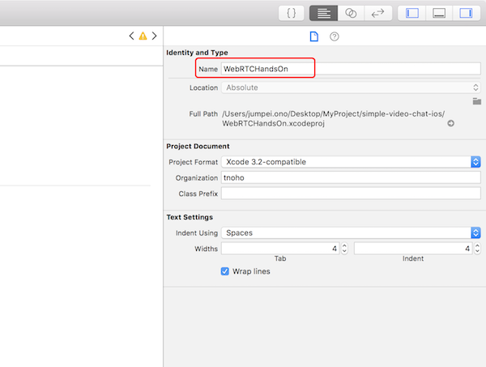
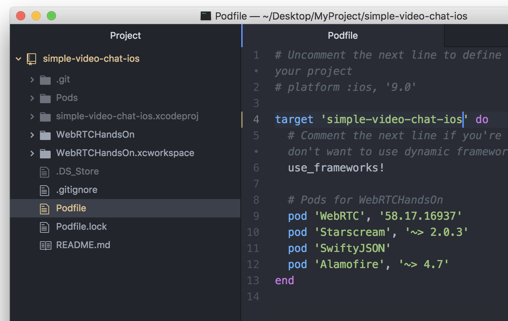

+++
title = "Xcode10でプロジェクト名を変更する"
url = "2018-11-12"
date = "2018-11-12"
description = "Xcode10でプロジェクト名を変更する"
tags = [
    "iOS",
]
categories = [
    "iOS",
]
archives = "2018/11"
aliases = ["migrate-from-jekyl"]
+++

 

こちらの記事を参考にさせていただきました。  
ありがとうございます！  
参考記事の方が丁寧に書いてありますので、わからないことがあったら是非そちらを  

[Xcodeでプロジェクト名を変更する方法 (Xcode8.0)](https://tech.librastudio.co.jp/index.php/2016/10/05/post-1038/)

今回は WebRTCHandsOn　というプロジェクト名を、simple-video-chat-ios というプロジェクト名に変更します。

1.Xcodeからプロジェクト名を変更する
右側ペインにその詳細が表示されるので「Identity and Type」のNameを新しいプロジェクト名(ここではsimple-video-chat-ios)に修正する。

確認とアラートが出るので、　rename　ボタンを押してリネームする。

2.Schemeの変更
画面上部のメニューから「Product」-> 「Scheme」->「Manage Schemes」 を選択します。  
アラートが表示されたら左下の 「+」 ボタンを選択し、新しいターゲット(リネーム後のターゲーット)を追加します。  

新しいターゲットを追加したら、古いターゲットを削除し、 close　します。

3.Podfileの修正  
CocoaPodsを使っている場合は、podファイルも修正が必要です。  
targetの箇所に新しいプロジェクト名を入力してください。  

podfileの修正が完了したら、Podディレクトリを削除し、　もう一度 pod install　を行います。  
前のプロジェクト名の.workplaceファイルは不要なので削除します。  

pod installが終わったら、General の　Linked Frameworks and Libraries を開き、半透明になっている古いプロジェクト名のLinkを削除します。

この状態でビルドし、エラーが出ないことを確認してください。  

5.ディレクトリ名の修正  
最後に手作業でディレクトリ名を新しい名前に修正します。  
ディレクトリ名を修正するとXcodeが認識しなくなってしまうので、 Identity and Type で新しいディレクトリを登録します。  

info.plist の読込先も間違っているので修正します。  

これで完了です！  

2019/06/20 追記  
リネームを行うとUnitTest, UITest が実行できなくなってしまいました。  
Target を一度削除して、作り直すとうまく動作しました。  

<!-- Google Ads -->


<!-- Amazon Ads -->

