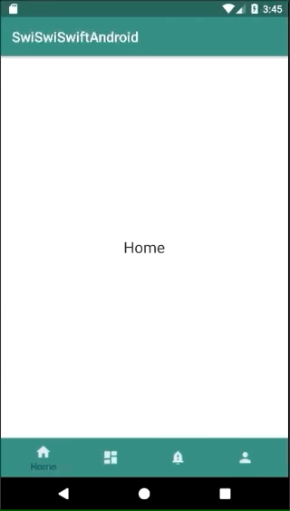

+++
title = "Fragmentsを入れ子にしたBottomNavigationを実装する"
url = "2018-11-13"
date = "2018-11-13"
description = "Fragmentsを入れ子にしたBottomNavigationを実装する"
tags = [
    "Android",
]
categories = [
    "Android",
]
archives = "2018/11"
aliases = ["migrate-from-jekyl"]
+++

 

BottomNavigationはiOSのTabBarControllerによく似たAPIです。  
BottomNavigationのタブを選択するとFragmentが切り替わるサンプルコードです。  

参考にさせていただいたページ。  
[BottomNavigationView入門](https://qiita.com/neonankiti/items/8f5a4b9039914192a948)  
[Bottom Navigation Android Example using Fragments](https://www.simplifiedcoding.net/bottom-navigation-android-example/)  

<!-- Google Ads -->


<!-- Amazon Ads -->



