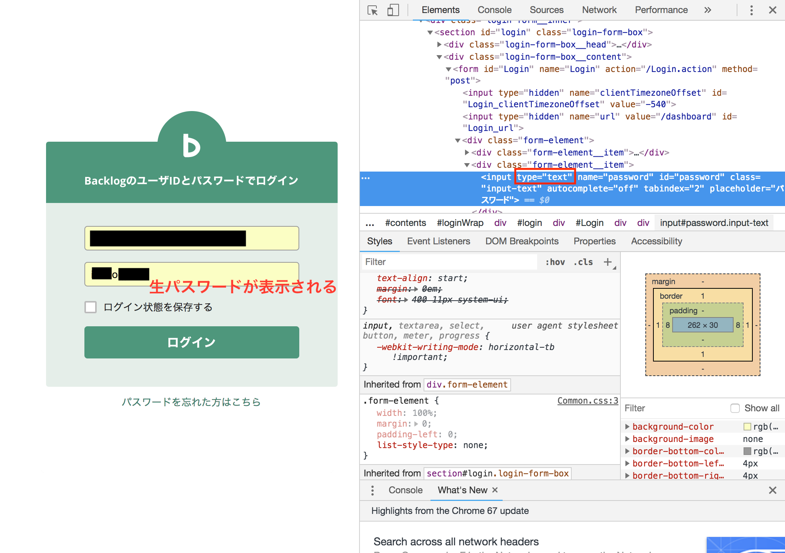

+++
title = "パスワードの入力欄の中身を確認したい"
url = "2018-11-14"
date = "2018-11-14"
description = "パスワードの入力欄の中身を確認したい"
tags = [
    "Other",
]
categories = [
    "Other",
]
archives = "2018/11"
aliases = ["migrate-from-jekyl"]
+++

 

ログイン画面のパスワード入力欄で黒丸●●●●●となっている中身を確認する方法です。  
要素と検証を開いて、inputタグの type を text　に変更します。  

<!-- Google Ads -->


<!-- Amazon Ads -->

