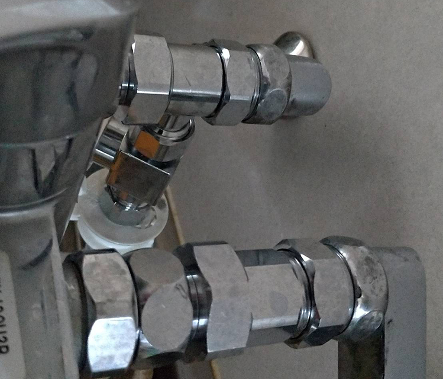

+++
title = "食洗機の分岐水栓取り付け工事を自分で行う。"
url = "2018-12-24"
date = "2018-12-24"
description = "食洗機の分岐水栓取り付け工事を自分で行う。"
tags = [
  "その他",
]
categories = [
    "その他",
]
archives = "2018/12"
aliases = ["migrate-from-jekyl"]
+++

 

例のPayPyaの20%キャッシュバックキャンペーンに釣られてビックカメラで食洗機を買いました。  
[パナソニック 食器洗い機（ホワイト）【食洗機】 Panasonic プチ食洗 NP-TCB4-W](https://amzn.to/2ZzdVkU)

食洗機の分岐水栓の取り付け工事は1万5千円(工事五千円+分岐水栓1万円)かかると言われたので、自分でやってしまおう！と思い自分でやりました。

分岐水栓と、様々な大きさのナットに対応できるモンキーレンチを購入します。  
分岐水栓の工事にはモンキーレンチは二つ必要です。(ナットを抑える用+ネジを回す用)

[SANEI 【食器洗い機用分岐ソケット】混合栓本体と偏心管の間に取り付けて分岐するタイプ PB515S ](https://amzn.to/36a4POa)

私のマンションの蛇口がTOTO製で、ナットのサイズが違うため分岐水栓(PB515S)がつけらえれなかったので、以下のアダプターも購入しました。  
蛇口のサイズと分岐水栓のサイズを確認し、もしアダプターが必要なら急いで分岐水栓と蛇口を持ってホームセンターに駆け込んで購入すれば良いと思います。

[SANEI 偏心管アダプター PT243S](https://amzn.to/2SExo2c)

[SANEI 偏心管アダプター PT242S](https://amzn.to/2F7wxPQ)

材料、道具が揃ったら早速工事をしていきます。水道の元栓を止め蛇口を取り外します。  
水道の元栓を止めずに蛇口を外すと大惨事になりますので気をつけてください。

蛇口を外したら分岐水栓やアダプターとサイズが合っているか確認します。  
この段階でサイズが合っていなかったら蛇口を元に戻すが、急いでホームセンターに駆け込みます。

分岐水栓、蛇口、アダプターを接続して完了です。
接続が甘いと水が吹き出します、その場合はすぐに元栓を止めてください。

