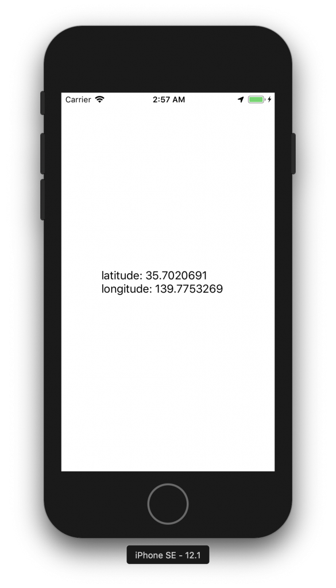

+++
title = "アプリ使用中に位置情報を取得する"
url = "2018-12-29"
date = "2018-12-29"
description = "アプリ使用中に位置情報を取得する"
tags = [
  "iOS",
]
categories = [
    "iOS",
]
archives = "2019/01"
aliases = ["migrate-from-jekyl"]
+++

 

#Swift 4.2

アプリ使用中に緯度と経度を取得するサンプルコードです。  
端末の緯度と経度が変わるとラベル文字列が更新されます。

参考  
[[iOS] 位置情報の取得 (Swift3編)](https://dev.classmethod.jp/smartphone/ios-corelocation-swift3/)  
[【CoreLocation】位置情報を取得する](https://qiita.com/chino_tweet/items/db3a536234a43a3c31d9)  

LocationManagerを使用する場合は、「位置情報を利用する目的」をInfo.plistに記載する必要があります。  

起動中のみ位置情報を取得する場合

`NSLocationWhenInUseUsageDescription`  
`このアプリは、マップで道案内するため、位置情報を取得します`

常に位置情報を取得する場合

`NSLocationAlwaysUsageDescription`  
`åこのアプリは、移動距離取得のため、常に位置情報を取得します`

位置情報が変更されるとラベルに文字が表示されます。

<!-- Google Ads -->


<!-- Amazon Ads -->



