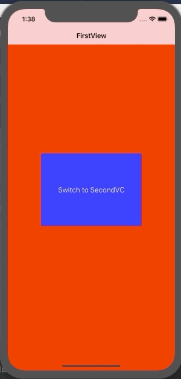

+++
title = "NavigationControllerのRootを切り替える（Swift4.2）"
url = "2019-01-20"
date = "2019-01-20"
description = "NavigationControllerのRootを切り替える（Swift4.2）"
tags = [
    "iOS",
]
categories = [
    "iOS",
    "Swift",
]
archives = "2019/01"
aliases = ["migrate-from-jekyl"]
+++

 
`# Swift4.2`  
`setViewControllers`でNavigationControllerのRootを切り替えています。

<!-- Google Ads -->


<!-- Amazon Ads -->



