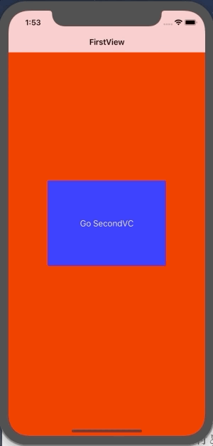

+++
title = "NavigationControllerで画面遷移を行う（Swift4.2）"
url = "2019-01-21"
date = "2019-01-21"
description = "NavigationControllerで画面遷移を行う（Swift4.2）"
tags = [
    "iOS",
]
categories = [
    "iOS",
    "Swift",
]
archives = "2019/01"
aliases = ["migrate-from-jekyl"]
+++

 
#Swift4.2

NavigationContorollerのサンプルコードです。  
NavigationContorollerは横にニュッと動いて画面遷移をします。  

<!-- Google Ads -->


<!-- Amazon Ads -->



