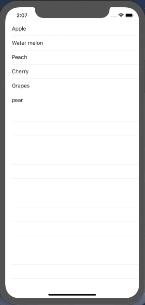

+++
title = "UITableViewでテーブルにアイテムを表示（Swift4.2）"
url = "2019-01-22"
date = "2019-01-22"
description = "UITableViewでテーブルにアイテムを表示（Swift4.2）"
tags = [
    "iOS",
]
categories = [
    "iOS",
    "Swift",
]
archives = "2019/02"
aliases = ["migrate-from-jekyl"]
+++

 
UITableViewはリストのような形でテキストを表示するクラスです。データ一覧などを表示する時などに役立ちます。

UITableViewのクラス階層

NSObject
↑
UIResponder
↑
UIView
↑
UIScrollView
↑
UITableView

[AppleDeveloperリファレンスUITableView](https://developer.apple.com/documentation/uikit/uitableview)

<!-- Google Ads -->


<!-- Amazon Ads -->



