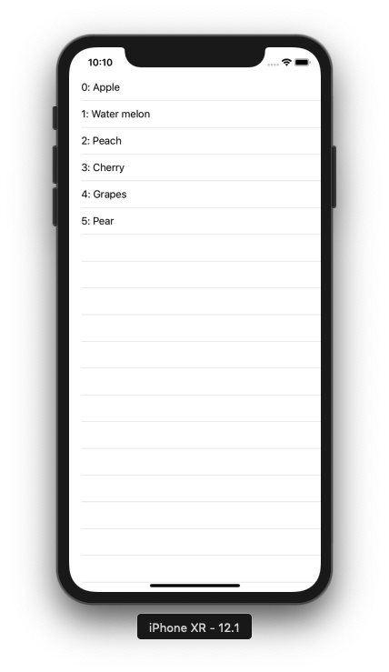

+++
title = "ローカルのJsonファイルをParseしてテーブルビューに表示する(Swift4.2)"
url = "2019-01-27"
date = "2019-01-27"
description = "ローカルのJsonファイルをParseしてテーブルビューに表示する(Swift4.2)"
tags = [
    "iOS",
]
categories = [
    "iOS",
]
archives = "2019/01"
aliases = ["migrate-from-jekyl"]
+++

 

ローカルに追加したJsonファイルをパースし、TableViewに表示するサンプルコードです。  
SwiftyJsonなどを使うともっと良い感じにかけますが、今回は使わないで書いてみました。

<!-- Google Ads -->


<!-- Amazon Ads -->



