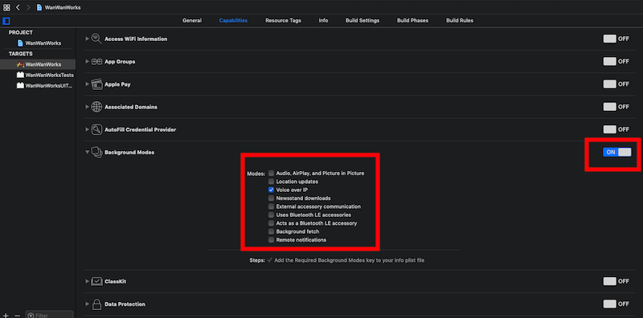
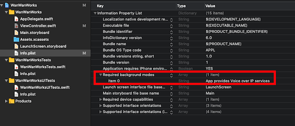

+++
title = "CallKit を使って着信画面を表示する"
url = "2019-05-12"
date = "2019-05-12"
description = "CallKit を使って着信画面を表示する"
tags = [
    "iOS",
]
categories = [
    "iOS",
]
archives = "2019/05"
aliases = ["migrate-from-jekyl"]
+++

 

CallKit を使うことで着信時のUIを使うことができます。
電話がかかってくるアプリを作る時に使いました。

<!-- Google Ads -->


<!-- Amazon Ads -->



