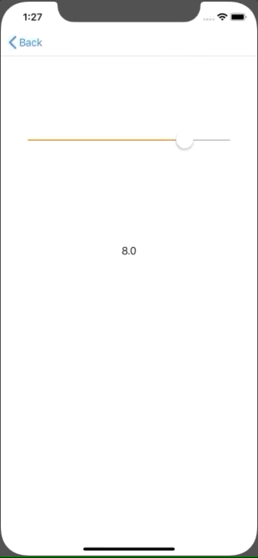

+++
title = "UISlider で値を取得する(Swift5.0)"
url = "2019-06-01"
date = "2019-06-01"
description = "UISlider で値を取得する(Swift5.0)"
tags = [
    "iOS",
]
categories = [
    "iOS",
]
archives = "2019/06"
aliases = ["migrate-from-jekyl"]
+++

 

UISlider で値を取得するサンプルコードです。
最小値と最大値を設定することで、その間の任意の値を取ることができます。

<!-- Google Ads -->


<!-- Amazon Ads -->



