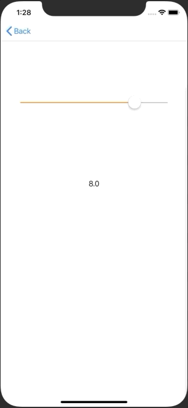

+++
title = "一定間隔の値をUISlider で取得する(Swift5.0)"
url = "2019-06-02"
date = "2019-06-02"
description = "一定間隔の値をUISlider で取得する(Swift5.0)"
tags = [
    "iOS",
]
categories = [
    "Swift",
    "iOS",
]
archives = "2019/06"
aliases = ["migrate-from-jekyl"]
+++

 

0, 0.5, 1.0, 1.5 …. と一定間隔の値をUISlider で取得するサンプルコードです。

<!-- Google Ads -->


<!-- Amazon Ads -->



