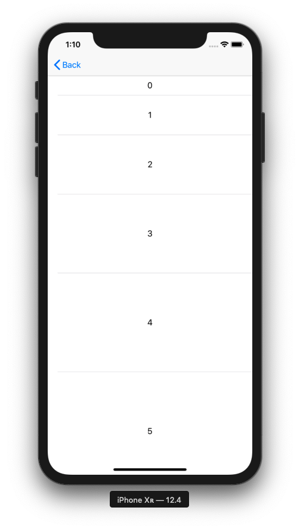

+++
title = "TableViewのセルの高さを変更する（Swift5.0.1）"
url = "2019-07-30"
date = "2019-07-30"
description = "TableViewのセルの高さを変更する（Swift5.0.1）"
tags = [
    "iOS",
    "Swift5",
]
categories = [
    "Swift",
    "iOS",
]
archives = "2019/07"
aliases = ["migrate-from-jekyl"]
+++

 

TableView のセルの高さを変更する方法です。  
一括で帰るときは .rowHeight を使い、個別に変えたいときは　heightForRowAt　を使うと実現できました。

サンプルコードはこちら。  
[https://github.com/takoikatakotako/swiswiswift-ios](https://github.com/takoikatakotako/swiswiswift-ios)

<!-- Google Ads -->


<!-- Amazon Ads -->


 


