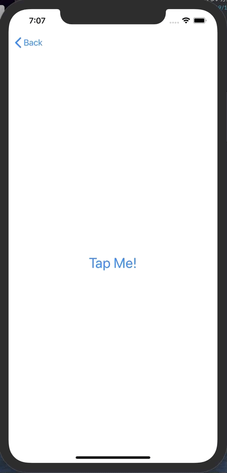

+++
title =  "SwiftUIでStructが使いまわされる"
url = "2019-11-14"
date = "2019-11-14"
description = "SwiftUIでStructが使いまわされる"
tags = [
    "iOS", "Swift"
]
categories = [
    "iOS", "Swift"
]
archives = "2019/11"
aliases = ["migrate-from-jekyl"]
+++

 
画面遷移をするたびに異なる ID を表示させたかったのですが、それができませんでした。（毎回同じ ID が表示される）

`onDisappear` で id を再生成することで回避しました。  
`@State` に変化が無い場合はキャッシュを使い回したりするということでしょうか？   
勉強していきます！！

<!-- Google Ads -->


<!-- Amazon Ads -->



