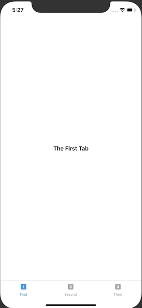

+++
title =  "TabViewを使って画面を切り替える（SwiftUI）"
url = "2019-11-21"
date = "2019-11-21"
description = "TabViewを使って画面を切り替える（SwiftUI）"
tags = [
    "iOS", "Swift", "SwiftUI"
]
categories = [
    "iOS", "Swift", "SwiftUI"
]
archives = "2019/11"
aliases = ["migrate-from-jekyl"]
+++

 

TabViewを使って画面を切り替えるサンプルです。
かなり簡単に書くことができますね。

[TabView - SwiftUI | Apple Developer Documentation](https://developer.apple.com/documentation/swiftui/tabview)

<!-- Google Ads -->


<!-- Amazon Ads -->



