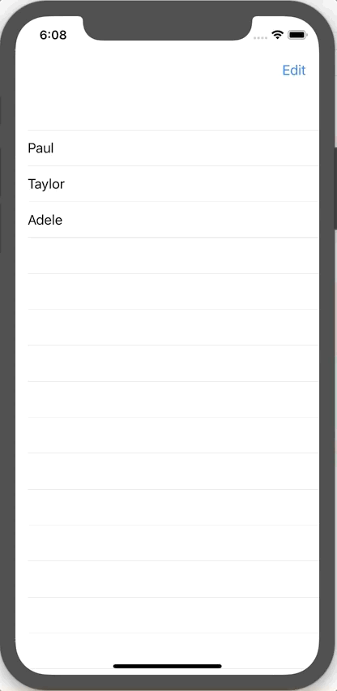

+++
title =  "SwiftUIでリストを編集する"
url = "2019-12-17"
date = "2019-12-17"
description = "SwiftUIでリストを編集する"
tags = [
    "SwiftUI"
]
categories = [
    "SwiftUI"
]
archives = "2019/12"
aliases = ["migrate-from-jekyl"]
+++

 

SwiftUIでリストを編集する方法です。
UITableView よりも短いコードで書くことができました。

参考: [How to enable editing on a list using EditButton](https://www.hackingwithswift.com/quick-start/swiftui/how-to-enable-editing-on-a-list-using-editbutton)

<!-- Google Ads -->


<!-- Amazon Ads -->



