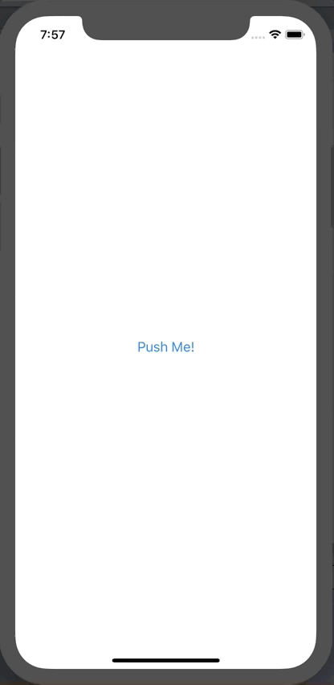

+++
title =  "SwiftUI でアラートを表示する"
url = "2019-12-20"
date = "2019-12-20"
description = "SwiftUI でアラートを表示する"
tags = [
    "SwiftUI"
]
categories = [
    "SwiftUI"
]
archives = "2019/12"
aliases = ["migrate-from-jekyl"]
+++

 

SwiftUI でアラートを表示する方法です。
UIAlertController とはかなり書き方が異なります。
`Property Wrapper` の `@State` がまだ慣れません。

<!-- Google Ads -->


<!-- Amazon Ads -->



