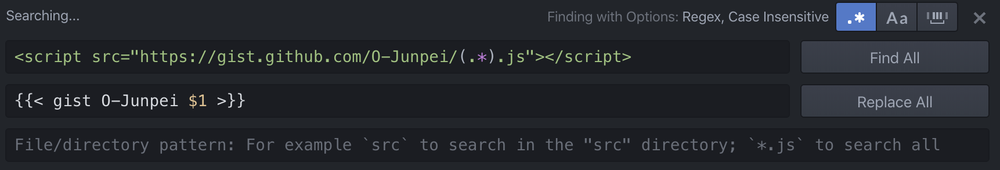

+++
title =  "HugoでGistが表示されない"
url = "2019-12-28"
date = "2019-12-28"
description = "HugoでGistが表示されない"
tags = [
    "Hugo"
]
categories = [
    "Hugo"
]
archives = "2019/12"
aliases = ["migrate-from-jekyl"]
+++

<br>

Hugo のバージョンを更新したところ、以下のような Gist のページが表示されなくなりました。

```
<script src="https://gist.github.com/takoikatakotako/5aba51305d74c009a2c878897837e006.js"></script>
```

以下のように書き換えることで動作しました。


参考: [Shortcodes](https://gohugo.io/content-management/shortcodes/)

<!-- Google Ads -->


<!-- Amazon Ads -->


置換は Atom の正規表現置換機能を使い一括置換を行いました。


