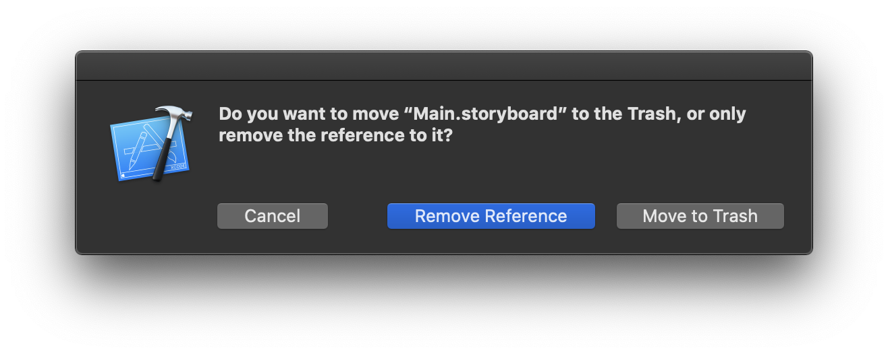
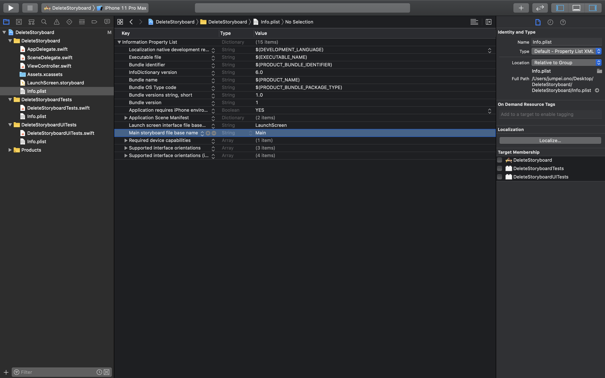
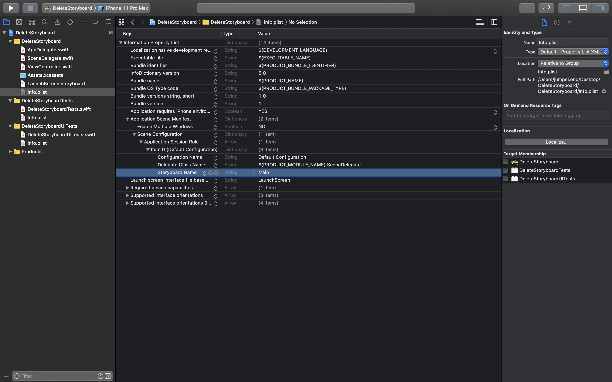

+++
title =  "StoryboardsをiOS13以上のプロジェクトから削除する"
url = "2019-12-29"
date = "2019-12-29"
description = "StoryboardsをiOS13以上のプロジェクトから削除する"
tags = [
    "Swift", "iOS"
]
categories = [
    "Swift", "iOS"
]
archives = "2019/12"
aliases = ["migrate-from-jekyl"]
+++

<br>

`Swift` & `Storyboard` でファイルを作成します。
`Main.storyboard` を削除します。



`Main storyboard file base name` の項を削除する。



`Application Scene Manifest` -> `Application Session Role` -> `Item0` -> `Storyboard Name` を削除する。

<!-- Google Ads -->


<!-- Amazon Ads -->





`SceneDelegate.swift` で表示する ViewController を設定します。

```
func scene(_ scene: UIScene, willConnectTo session: UISceneSession, options connectionOptions: UIScene.ConnectionOptions) {
    guard let windowScene = (scene as? UIWindowScene) else { return }
    window = UIWindow(frame: UIScreen.main.bounds)
    let viewController = ViewController()
    window?.rootViewController = viewController
    window?.makeKeyAndVisible()
    window?.windowScene = windowScene
}
```

参考  
[Creating Apps Without Storyboards in iOS 13](https://medium.com/better-programming/creating-apps-without-storyboards-in-ios-13-fc9550bb9c12)
