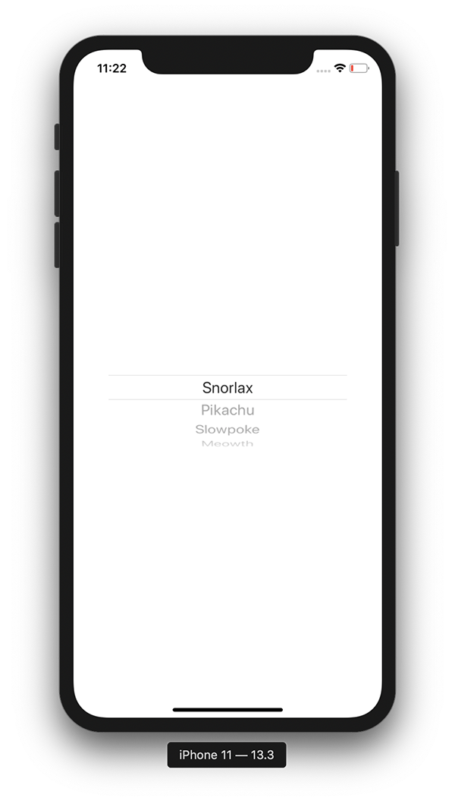

+++
title =  "SwiftUIのPickerでLabelを表示しない"
url = "2020-01-13"
date = "2020-01-13"
description = "SwiftUIのPickerでLabelを表示しない"
tags = [
    "Swift", "SwiftUI"
]
categories = [
    "Swift", "SwiftUI"
]
archives = "2020/01"
aliases = ["migrate-from-jekyl"]
+++

 

SwiftUIのPickerでLabelを表示しない方法です。
`labelsHidden` を設定することで可能です。

参考: [How to hide the label of a Picker, Stepper, Toggle, and more using labelsHidden()](https://www.hackingwithswift.com/quick-start/swiftui/how-to-hide-the-label-of-a-picker-stepper-toggle-and-more-using-labelshidden)

<!-- Google Ads -->


<!-- Amazon Ads -->



