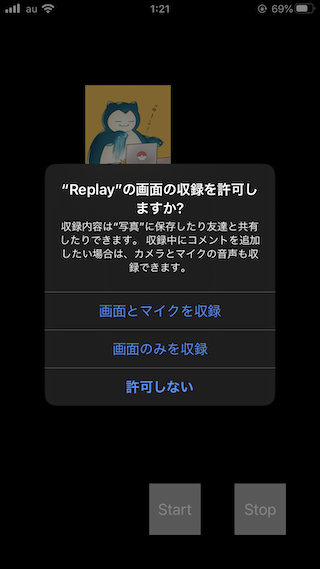

+++
title =  "ReplayKitを使って画面を録音する"
url = "2020-02-12"
date = "2020-02-12"
description = "ReplayKitを使って画面を録音する"
tags = [
    "Swift"
]
categories = [
    "Swift"
]
archives = "2020/02"
aliases = ["migrate-from-jekyl"]
+++

 

ReplayKit を使うと画面を録画することができます。
凄く簡単に使うことができる上に、マイクで実況？をしたりすることができます。
今回は動画として保存しましたが、WebRTC と組み合わせたりと、いろいろなことに使うことができます。

<!-- Google Ads -->


<!-- Amazon Ads -->



