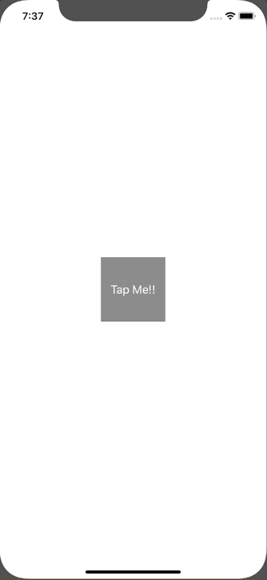

+++
title =  "UIViewの背景をグリッドにしたり、ドットにしたりする"
url = "2020-02-14"
date = "2020-02-14"
description = "UIViewの背景をグリッドにしたり、ドットにしたりする"
tags = [
    "Swift"
]
categories = [
    "Swift"
]
archives = "2020/02"
aliases = ["migrate-from-jekyl"]
+++

 

UIView の背景をグリッドにしたり、ドットにしたりする方法です。
今回は GridView という UIView のサブクラスを作り、ボタンを押すことでドットが切り替わるようにしました。

<!-- Google Ads -->


<!-- Amazon Ads -->



