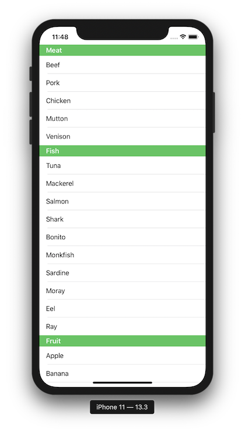

+++
title =  "SwiftUIのListのSectionの色を変える"
url = "2020-02-19"
date = "2020-02-19"
description = "SwiftUIのListのSectionの色を変える"
tags = [
    "Swift"
]
categories = [
    "Swift"
]
archives = "2020/02"
aliases = ["migrate-from-jekyl"]
+++

 

SwiftUIのListのSectionの色を変えるサンプルです。
Appearanceを使って背景色を変えている記事がいくつかありますが、以下の方法でもできました。
 
[Remove/change section header background color in SwiftUI List](https://stackoverflow.com/questions/56867334/remove-change-section-header-background-color-in-swiftui-list)

<!-- Google Ads -->


<!-- Amazon Ads -->



