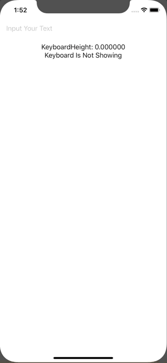

+++
title =  "SwiftUIでKeyboardの高さや出現を検知する"
url = "2020-02-28"
date = "2020-02-28"
description = "SwiftUIでKeyboardの高さや出現を検知する"
tags = [
    "Swift"
]
categories = [
    "Swift"
]
archives = "2020/02"
aliases = ["migrate-from-jekyl"]
+++

 

SwiftUIでKeyboardの高さや出現を検知する方法です。
Combineを使って実現しています。

<!-- Google Ads -->


<!-- Amazon Ads -->



