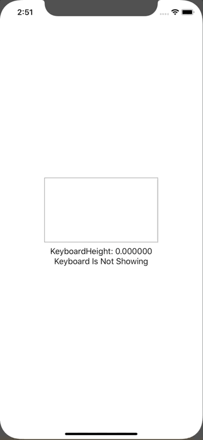

+++
title =  "SwiftUIでキーボードをボタンで隠す"
url = "2020-02-29"
date = "2020-02-29"
description = "SwiftUIでキーボードをボタンで隠す"
tags = [
    "Swift"
]
categories = [
    "Swift"
]
archives = "2020/02"
aliases = ["migrate-from-jekyl"]
+++

 

SwiftUIでキーボードをボタンで隠す方法です。
UIApplicationを拡張して実現しています。

[SwiftUIでキーボードを下げる（非表示にする）方法](https://qiita.com/Riscait/items/8e76182d8b4c2def0953)

<!-- Google Ads -->


<!-- Amazon Ads -->



